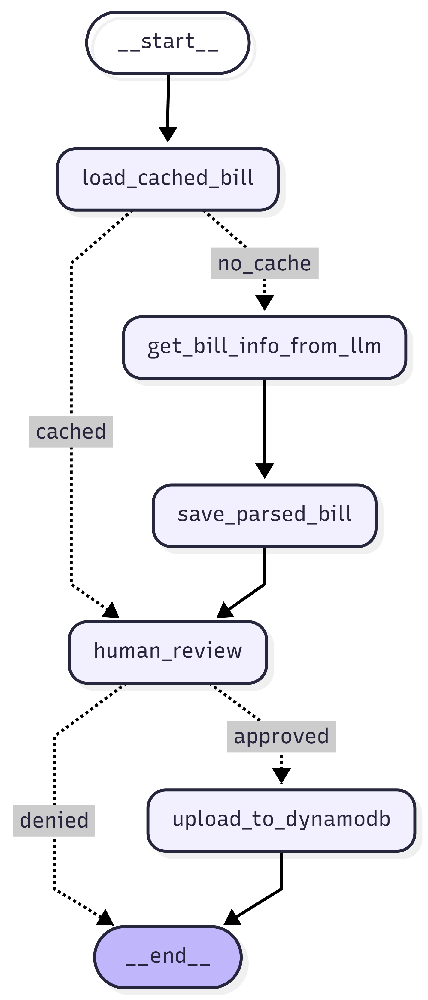
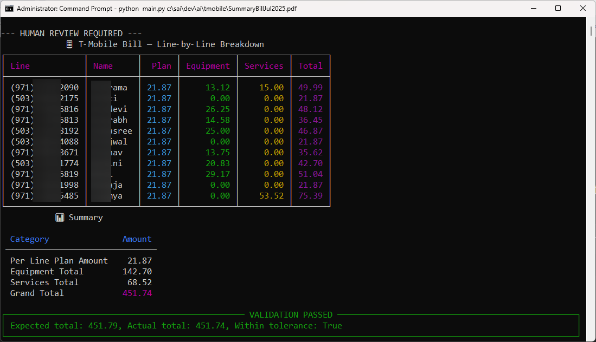

## T-Mobile Shared Bill Parser

This repository contains a small pipeline that extracts text from a shared T‑Mobile bill PDF, sends the text to a Gemini LLM for structured extraction, saves the parsed JSON, allows a human review step, and (optionally) uploads parsed bills to a database.

The implementation uses LangGraph to model the stateful workflow and a Gemini-based LLM call (see `services/llm_service.py`) to generate structured JSON representing the bill and per-user amounts.

## Overview

- Input: A T‑Mobile bill PDF.
- Processing steps:
	1. Extract text from the PDF using `services.pdf_service.extract_text_from_pdf`.
 2. Send extracted text + prompt + user info to Gemini via `services.llm_service.extract_bill_with_gemini` to get a parsed JSON structure.
 3. Save the parsed JSON into a `saved_bills/` directory using the naming convention `{MonthName}_{Year}.json` (e.g. `January_2025.json`). If a file exists, a numeric suffix is added.
 4. Present parsed JSON for a human review step.
 5. On approval, upload the parsed bill to the DB via `services.storage_service.upload_to_db`.

The LangGraph workflow is defined in `workflow.py` and the key nodes live in `nodes/`.



Human review will be given a color coded individual bill like below


___

## Architecture (quick)

- `main.py` — CLI entrypoint that accepts a PDF path, builds the initial state, and invokes the LangGraph workflow.
- `workflow.py` — Builds the LangGraph `StateGraph` and wires nodes together.
- `nodes/` — Node implementations:
	- `bill_extraction_node.py` — Calls the LLM extraction.
	- `save_json_node.py` — (new) saves the parsed JSON into `saved_bills/` as `{MonthName}_{Year}.json` and sets `saved_bill_path` in state.
	- `human_review_node.py` — Prints the parsed bill for human approval and optionally writes a temporary file for review.
	- `upload_node.py` — Uploads parsed bill to the DB.
- `services/` — Helpers for LLM, PDF text extraction, storage, user data, etc.

## Diagrams

Place the following images in this directory (they are referenced by name):

- `workflow.png` — High-level workflow diagram: get_bill_info -> save_parsed_bill -> human_review -> (approved -> upload_to_dynamodb | denied -> END)
- `human-review.png` — Screenshot or mockup of the human-review CLI output (table view of parsed bill and approve/deny prompt).

Add those images next to this README so they render on Git hosting platforms.

## How to run

Prerequisites

- Python 3.8+ (3.10/3.11 recommended).
- A Gemini API key exported to environment variable `GEMINI_API_KEY`. The project uses `langchain_google_genai.ChatGoogleGenerativeAI` and reads the key from `os.getenv("GEMINI_API_KEY")` in `services/llm_service.py`.
- Install required Python packages. If you maintain a `requirements.txt`, use it; otherwise you can install the likely packages used by this project:

PowerShell example (recommended):

```powershell
# Create and activate a venv
python -m venv .venv
.\.venv\Scripts\Activate.ps1

# Install dependencies (if you have requirements.txt)
pip install -r requirements.txt

# If there's no requirements file, you can install the core deps used here:
pip install langgraph langchain-google-genai
```

Set the Gemini key (PowerShell):

```powershell
$env:GEMINI_API_KEY = "your_gemini_api_key_here"
```

Run the CLI

```powershell
# from this directory (populator)
python main.py C:\path\to\shared_tmobile_bill.pdf
```

What to expect

- The script prints the PDF base name, then the workflow executes.
- A parsed JSON will be saved into `saved_bills/` (created next to `nodes/`) with a name like `January_2025.json` (the node attempts to infer month/year; if none found it uses the current month/year).
- The human-review node prints the parsed bill and prompts for input. Type `approve` to proceed with upload, anything else to stop.
- On approval the pipeline attempts to upload via `services.storage_service.upload_to_db` and sets `upload_status` in the workflow state.

Troubleshooting & notes

- If Gemini returns non-JSON, `services/llm_service.py` attempts to clean fences and parse. The function returns an `error` object if parsing fails — check the `parsed_bill` contents printed during review.
- To change the saved JSON location, edit `nodes/save_json_node.py` where `base_dir` is set. You can make this configurable via environment variables or a config file.
- If you rely on a specific DB, double-check `services/db.py` and `services/storage_service.py` for any required credentials.
